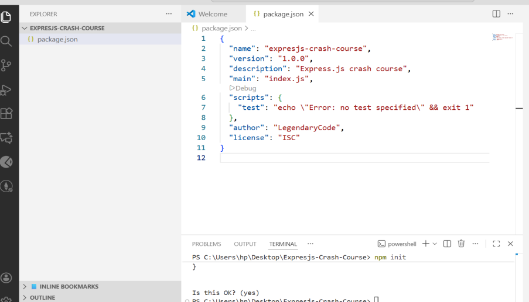

**MASTERING EXPRESSJS CRASh COURSE**

**Requirement / Prerequisites**  
1.JavaScript fundamentals (functions, loops, objects, classes etc)  
2. Asynchronous programming - Promise, callbacks, async/await.   
3. HTTP Basics  (Methods, status codes, etc)   
4. How JSON APIs work.   
5.Basic understanding of  Node.js
6.NPM (Node Package Manager)

➡️ **EXPRESS.JS**  
✔️ What is Express.js ?  Express.js , is a Node.js framework, which has the following attributes / characteristic : It,  
1) Minimal and flexible web framework for Node.js  
2) Used for building “Server-Side Web Applications”, “Micro Services” and “APIs” .  
3)The most popular framework for Node.  
4) Simplifies the process of handling HTTP requests and responses.  
5) Express is a very fast and unopinioated framework.  

➡️ **Opinionated Vs Unopinionated (Framework)**
✔️ Opinionated (Frameworks):  
1) Has a lot of rules  & conventions that you need to follow.  
2) Suggested ways to do things .  
3) Strict folder  structure.  
4) Suggested ways to do things .  
5) Strict folder  structure.  

✔️ Unopinionated (Frameworks):  
1) They  are extremely flexible (U can can structure apps how ever you want, & use what ever database, library you want).  
2) Different ways to do things .  
3) Includes the bare necessities.  
4) Structure folders how you want.  
5) Some Examples Include: Express.js , Flask, Spring .  

✔️ When Creating A Express.js Project:  
	**NOTE:** When starting a new “nodejs project”.  
The first 1st thing You will need to create a  “package.json” file .  
And we 	can do that by using an “NPM command on VSCode terminal (instead of creating it manuel)”, bellow is the following step :  
 npm init   
   

The 2 Second 2nd  thing You do is to install “Express.js” & “save” it in your 	package.json 	dependencies, (in your project , use this command):   
Npm install express --save  
   

The 3 Third 3rd   thing You do is to create the gitignore file in your Code Editor (e.g VSCode):  
.gitignore file, allows developers to specify which files and directories should be excluded from version control (Git). This helps keep repositories tidy, preventing sensitive information from being exposed , and ensures that only essential files are tracked.   A diagram below:  

